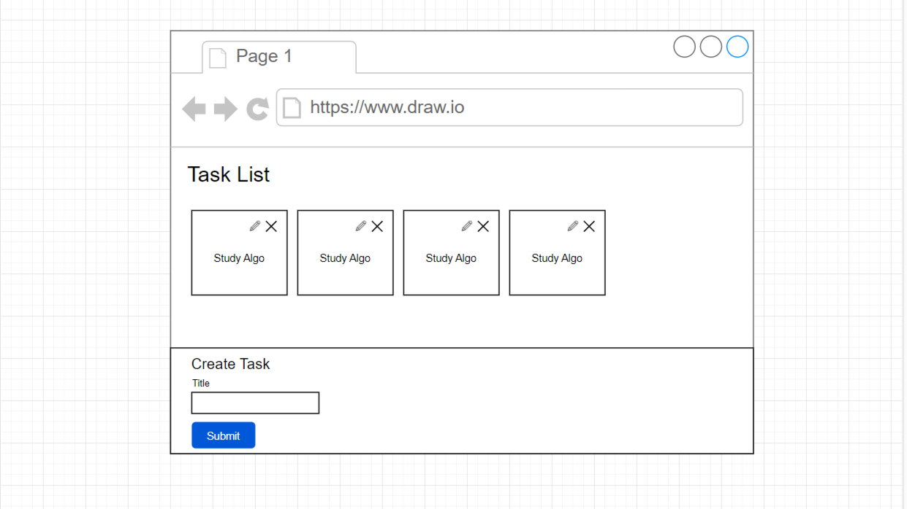
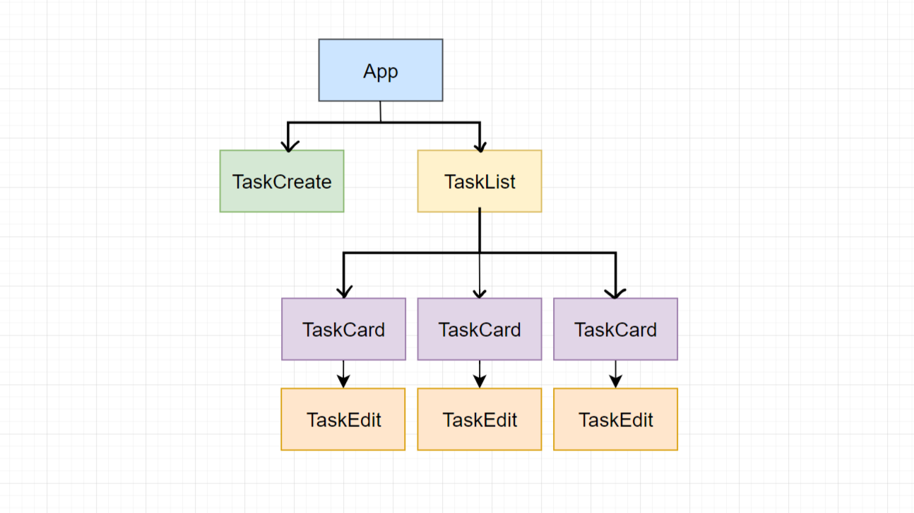

# tasker-in-react
## Introduction
A lab project for practicing handling forms in reactjs and react states.

## The Project
This app contains a list of tasks in the landing page, which can be created through the task creator form that is given below in the page.

### Diagram
 

### Component Hiararchy
 

## Features and Functionalities
>### Version 1 `Singara`💡
>The version 1 of the app contains a Create Task section at the bottom. Whenever user enters some tasks in the given input field and hits the create button, The tasks get displayed on the screen as a ordered list. Besides these functionalities, this version also contains a speciall method in the tasker app that clears all the listed tasks.

>#### The `alldone()` method
>Whenever user types `alldone()` in the new task input and submits, all the listed tasks gets deleted and the app becomes new.

>### Verison 2 `Kochuri` 🍪
>The Version 2 `Kochuri` contains better styling and a delete button on each tasks. Kochuri also contains functionality that capitalizes the first letter of the task. It also has another method, that is just an alternative of the `alldone()` method.

>#### The `alldel()` method
>The `alldel()` method and `alldone()` methods are basically same, but a user can use them on their own contexts.

>### Version 3 `Pokora` 🧆
>The Version 3 `Pokora` contains a better user experience with the same functionalities of the previous version.

>### Version 4 Begni 🍆
>The Version 4 `Begni` now gives the user option to Edit the tasks. 

>### Version 5 Piyaji 🍪
>The Version 5 `Piyaji` of the Niyoga app has a backend support and all the data get's fetch from a json server. In result, the app will have all the data preserved even if the app is closed.
>The custom methods are restored as well. The methods will delete all the data from the database.

>### Version 6 Chopp 🧉
>In The Version 6 `Chopp` of the Niyoga app the `alldone()` method's functionality has been changed to marking all task green. On the other side a new method is on board `allundone()`, which will do exactly the opposite of `alldone()`, meaning will remove green from all tasks.
>
>**Issue** :- Although the app now hot three methods to increase productivity, the backend json server is not really able to handle repeated tens requests. Hence when the app has many tasks listed the methods will not work properly. This will fixed in the next versions, as we will use other servers.

>### Version 7 Gathia 🥖
>Version 7 `Gathia` simply uses the context system from react rather than only states & props. This gives more clear code to understand and better user and development performance. 
Also the version 7 got introduced with some more methods. Those are - 

>#### The Done methods
>These methods can be used to mark all tasks as done.
>* `alldone()` 
>* `allgreen()` 
>* `green()`
>* `done()` 

>#### The Undone methods
>These methods can be used for marking all tasks as undone.
>* `allundone()`
>* `undone()`
>* `reset()`

>#### The Delete methods
>These methods can be used for deleting all tasks at once.
>* `alldel()`
>* `del()`
>* `delete()`

 

 

# Standard Commit Notations
### On Version Release

`Version [Version number] Release`

### On Patch/fix/changes (minor/major)

`Patch [Version index].[patch index]`

### Development Phase commits

`v[version number that is currently being developed] Delta [index of major changes, ie. Component additions].[index of small changes following the major change].`

`Example`  => `v4 Delta 1.8`

 This Commit title represents that Version 4 is in Development right now, and in the development process so far, one major change have been commited and follwing that change 8 small changes have been commited.

 Following any update, if any very minor change is commited, such as spelling mistakes or something mistekenly forgotten, then that commit might have a index following a . (dot) after the version number.

`Example` => `v4 Delta 2.1.1`

 This commit suggests that some very small change is commited following the  `v4 Delta 2.1`  commit.

### On Devnotes update

`v[version under development] echo mic [index of devnotes update]`

`Example` => `v4 echo mic 1`

This Commit title repressents that while Version 4 of the app is in Development phase, devnotes is updated for some announcement/notification and the index of such announcement/notification is 1.

### On Readme.md update

`Readme update v[version currently under development] n[index of readme update] ` => **Used Currently**

Previously this type of commits are done as 

`README update v[version currently under development] #[index of readme update] `

Note:- The first Notation is used currently

then as the extended description 

`some description`

ignore. routine push check
